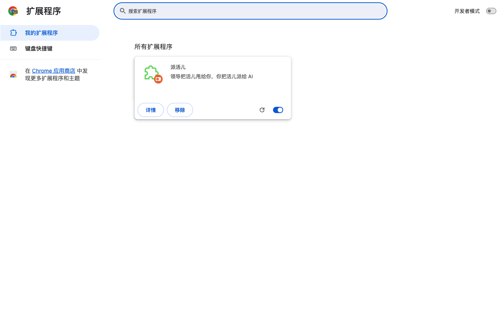
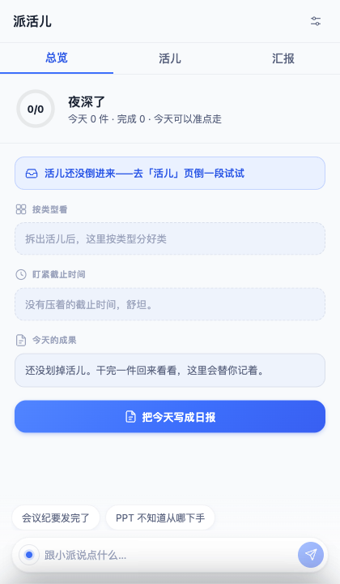
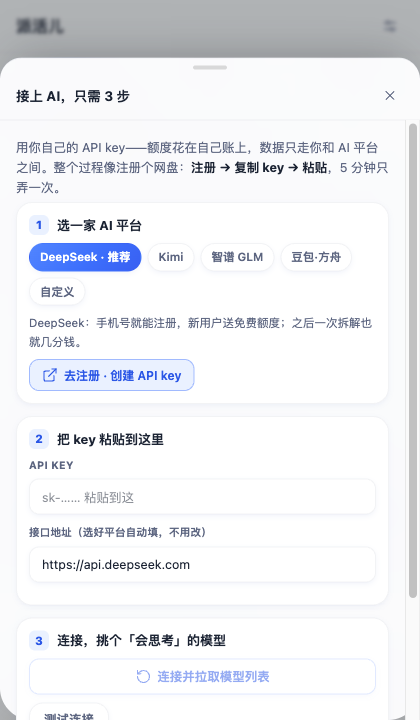
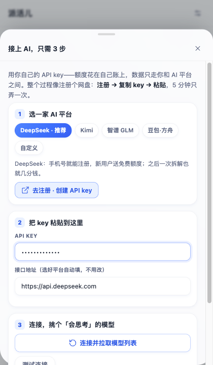
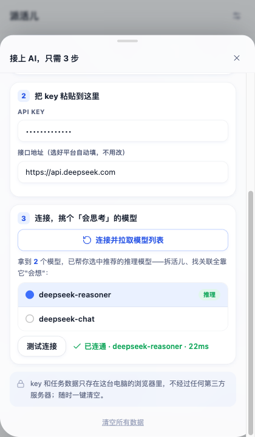

# 派活儿 Paihuo

> **一句话**：浏览器侧边栏插件，帮不太会用 AI 的打工人——把任务倒进来，自动拆成清单，标注 AI 能帮多少、该用哪个工具、第一句话说什么；聊进度自动划卡；一键写日报/周报/月报。
> **形态红线**：Chrome MV3 sidePanel · 无后端无账号 · 数据全本机 · **BYOK**（用户自己的 API key，产品负责把「注册→创建→复制→粘贴」引导到傻瓜级，绝不内置开发者的 key）。

当前版本 **v0.1.0**（mock 全链路验证通过；真实模型效果尚待 T24 用真 key 冒烟评测，还没上架应用商店）。

## 安装（Chrome / Edge 通用）

派活儿目前还没上架应用商店，需要用「开发者模式」手动装一次，装完之后跟普通插件一样正常用，不需要每次都这样。

1. 拿到扩展包：自己跑一遍 `pnpm zip`，在 `.output/paihuo-0.1.0-chrome.zip` 拿到包；解压到任意一个你不会手滑删掉的文件夹。
2. 浏览器地址栏打开 `chrome://extensions`（Edge 是 `edge://extensions`），右上角把「开发者模式」打开。
3. 点「加载已解压的扩展程序」，选中第 1 步解压出来的文件夹。
4. 加载成功后，扩展列表里会出现「派活儿」：

   

5. 点工具栏里的派活儿图标（或按快捷键 `Ctrl+Shift+Y`，Mac 是 `Command+Shift+Y`）打开侧边栏，第一次打开长这样：

   

## 接上 AI，只需 3 步

侧边栏右上角点齿轮，跟着向导走一遍——全程不用离开这个面板，key 只存在你自己电脑的浏览器里，不经过任何第三方服务器：

1. **选一家 AI 平台**——没有账号的话点「去注册·创建 API key」，DeepSeek 手机号就能注册，新用户送免费额度。

   

2. **把 key 粘贴到这里**——接口地址已经按平台自动填好，不用改。

   

3. **连接，挑个「会思考」的模型**——点「连接并拉取模型列表」，会自动帮你选中推荐的推理模型，再点「测试连接」确认打通。

   

连通之后就能用了：把领导甩给你的活儿倒进「活儿」页 → AI 拆成带工具和提示词的任务卡 → 复制提示词跳转对应工具 → 跟小派聊几句盯进度 → 收工时去「汇报」页一键出日报。

---

## 开发目标（Definition of Victory）

> 以下内容面向要修改代码 / 继续开发的人；只是想用这个插件的话，看到上面就够了。

一个可在 Chrome/Edge 开发者模式安装的 **v0.1.0 zip**：

1. 用户走完「接上 AI，只需 3 步」向导（选平台→粘 key→连接选推理模型）后，能**真实**完成：倒活（文字/文件/截图）→ 拆解成带工具与提示词的任务卡 → 复制提示词跳转工具 → 对话盯活 → 生成日报/周报（可套公司模板）。
2. **完整智能体，不是散调用**：所有 AI 能力经统一 harness（agent loop / 工具编排 / 提示词装配 / 上下文压缩 / 事件触发 / trace），`#/trace` 可回放每次 run，UI 全程可见 agent 在干嘛（见 `docs/02-agent-architecture.md`）。
3. mock 模式（`VITE_PAIHUO_MOCK=1`）下 `pnpm e2e` 全链路绿 + `pnpm eval` 评测套件绿。
4. 权限最小化、无后端；spec §9 范围之外一律不做。

## 整体规划（一页纸）

| 里程碑 | 任务 | 出口标准 |
|---|---|---|
| M0 地基 | T01-T04 脚手架 / 令牌组件 / 数据层 / LLM 传输层+mock | 面板壳跑通，单测绿 |
| **M1 Harness 核心** | T05-T08 工具注册执行 / Agent Loop / 上下文管理 / 提示词装配+trace | 智能体心脏可跑：mock 多轮工具调用 + `#/trace` 可回放 |
| M2 接 AI | T09 三步向导（注册引导/拉模型/推理推荐/测连接） | mock 全流程可走，错误态友好 |
| M3 核心循环 | T10-T13 内容工具 / 拆解官链路 / 工具目录 / 整理官+筛选 | 核心价值可演示 |
| M4 盯活 | T14-T17 小派 orchestrator / 长期记忆 / 总览 / 事件编排 | 「纪要发完了」自动划卡，agent 活动全程可见 |
| M5 报活 | T18 汇报官 + 模板 | 五动词闭环 |
| M6 收口 | T19-T23 评测套件 / 右键 / 打磨 / e2e / 打包 | `pnpm e2e` + `pnpm eval` 绿，zip 装上即用 |
| ⛔ 停点 | T24 真 key 冒烟+真模型评测 · T25 商店上架 | **必须先问用户** |

预估：M0→M6（mock 全绿）约 7-10 个全职循环日；T24 之后按真实模型评测分迭代提示词（契约不变）。

## 怎么执行（给 Claude / Sonnet 5）

**启动指令（用户粘贴这句即可）：**

> 读 CLAUDE.md、docs/00-product-spec.md、docs/01-dev-plan.md，按 Goal 运行协议从 T01 开始持续循环，直到触发停点或全部完成。

循环规则（详见 `CLAUDE.md`）：取最低编号 ready 任务 → 简述方案 → TDD → **真实验证达 DoD**（UI 任务必须起真实扩展，禁止只跑单测宣称完成）→ 在 `docs/01-dev-plan.md` 勾掉并追加 `✅ 日期 验证方式` → git commit → 下一个。LLM 功能一律先跑 mock，真 key 只在 T17（先问用户要）。连败 3 次 / 要花钱 / 要发布 / 想超出 spec → 停下问用户。

## 文件地图

| 文件 | 角色 |
|---|---|
| `README.md` | 本文：目标、总规划、启动方式 |
| `CLAUDE.md` | 执行协议：Goal 循环、验证纪律、停点、技术栈锁定 |
| `docs/00-product-spec.md` | 产品规格 SSOT：逐屏规格、数据模型、四个 Agent Profile 行为契约、工具目录、平台表、范围边界 |
| `docs/02-agent-architecture.md` | **智能体机制 SSOT**：harness 循环、工具编排、提示词装配、上下文管理、事件、trace、evals |
| `docs/01-dev-plan.md` | 任务清单 T01-T25：每个带 DoD 与验证方式 |
| `prototype/paihuo-prototype.html` | **UI/UX 像素级权威**（自包含，浏览器直接打开对照；豆包蓝设计令牌在文件头 `:root`） |
| `docs/install/*.png` | 本文顶部「安装」「接上 AI」两节用的截图 |
| `docs/qa/*.png` | 每个任务的验证截图（本地留存，不进 git，体积会失控） |
| `e2e/`、`playwright.config.ts` | `pnpm e2e`：mock 全链路冒烟（配置→倒活→拆解→筛选→对话→汇报→重启数据仍在→trace） |
